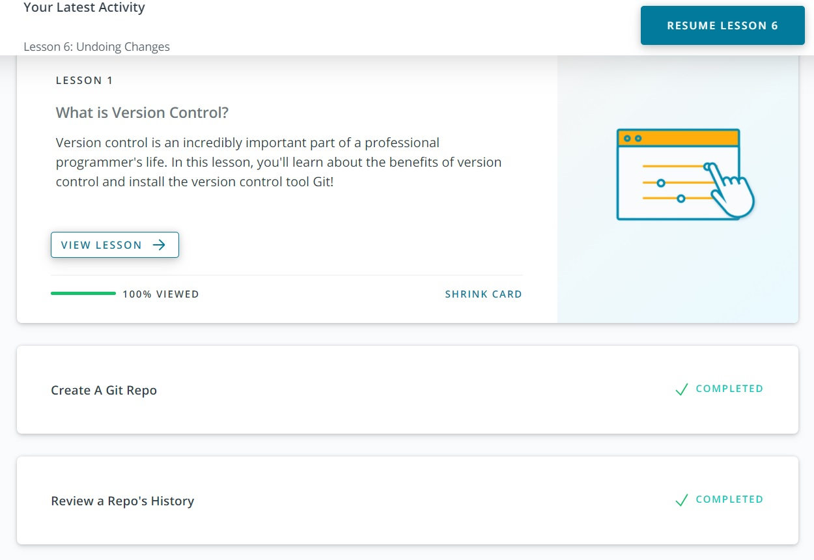
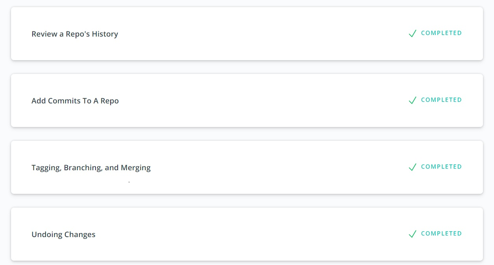
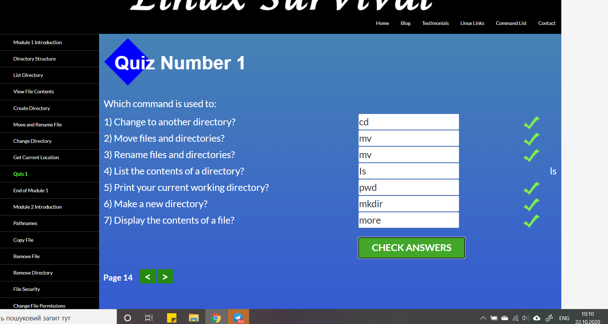
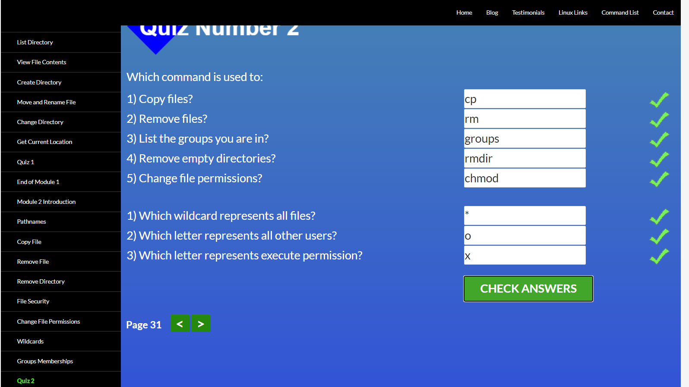
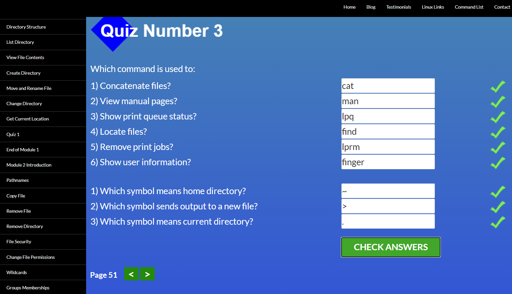
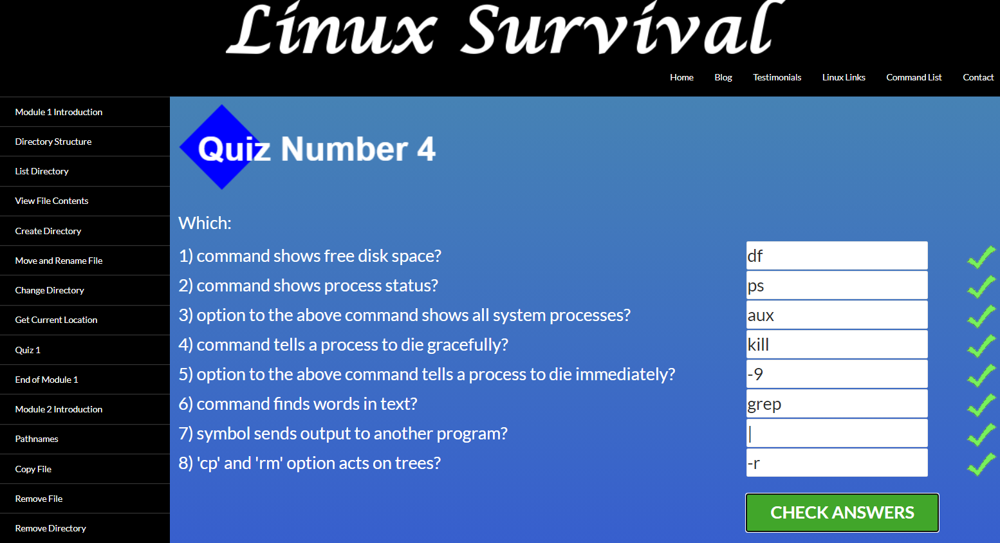
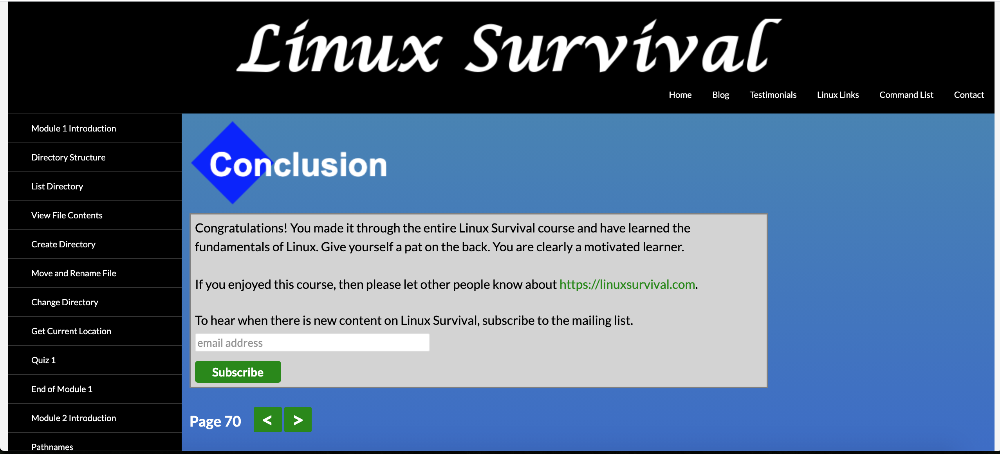
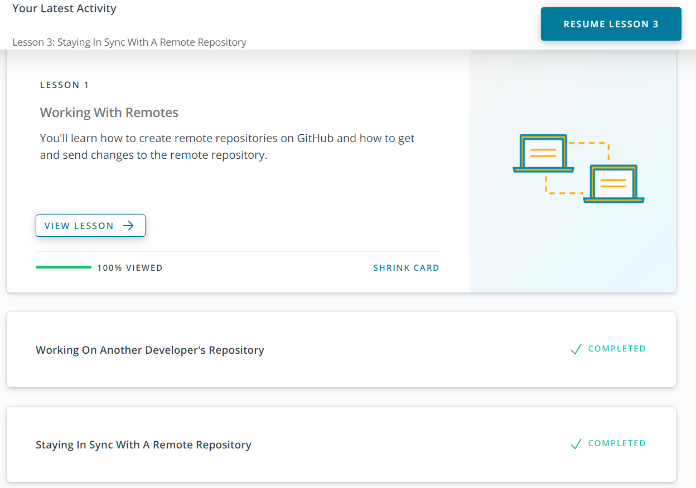
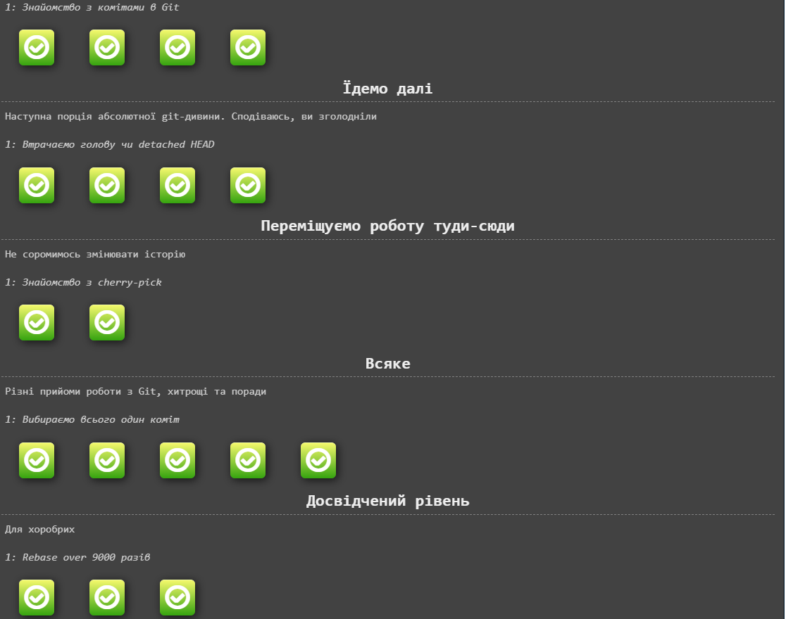
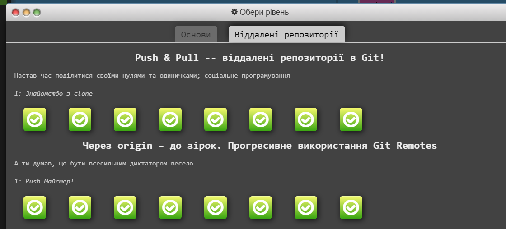

# kottans-frontend

## Repository dedicated to participation in [Kottans frontend course](https://github.com/kottans/frontend)
## My progress :rocket:

 1. **GENERAL**
    - [x] [Git and Github](#1-git-and-github)
    - [x] [Linux CLI and Networking](#2-linux-cli-and-networking)
    - [x] [VCS (hello gitty), GitHub and Collaboration](#3-vcs-hello-gitty-github-and-collaboration)
  
 2. **FRONT-END BASICS**
  
    - [ ] [Intro to HTML & CSS](#4-intro-to-html-css)
    - [ ] [Responsive Web Design](#5-responsive-web-design)
    - [ ] [HTML & CSS Practice](#6-html-css-practice)
    - [ ] [JavaScript Basics](#7-javascript-basics)
    - [ ] [Document Object Model - practice](#8-document-object-model-practice)
  
 3. **ADVANCED TOPICS**

    - [ ] [Building a Tiny JS World (pre-OOP) - practice](#9-building-a-tiny-js-world-pre-oop-practice)
    - [ ] [Object oriented JS - practice](#10-object-oriented-js-practice)
    - [ ] [OOP exercise - practice](#11-oop-exercise-practice)
    - [ ] [Offline Web Applications](#12-offline-web-applications)
    - [ ] [Memory pair game — real project!](#13-memory-pair-game-real-project)
    - [ ] [Website Performance Optimization](#14-website-performance-optimization)
    - [ ] [Friends App - real project!](#15-friends-app-real-project)
  

## GENERAL

### 1. Git and GitHub

***

#### 1.1. Course [Version Control with Git](https://www.udacity.com/course/version-control-with-git--ud123)

[

[]

Before starting this course i didn't know anything about Git. So everything was new for me. I can say I was learning Git from zero.

I learned how to: 

- use commands
- add commits
- branch
- merge
- add changes into repository
- create and delete tags and branches
- switch between branches 

This online course is very good because it has a lot of visual information which is much easier to remember. I will keep to myself

***

### 2. Linux CLI and Networking

***

#### 2.1 Course [Linux Survival (4 modules)](https://linuxsurvival.com/linux-tutorial-introduction/)

- **What was new**
Everything was new for me. It's my first Linux study. It wasn't easy but for that I have my notes here.
At this course I learned many new commands:
- `ls` - lists the contents
- `mkdir` - to create a repository
- `mv` - to move/rename a file
- `cd` - change directories
- `pwd` - (print working directories) to find out where you are
- `more`- displays contents of a file
- `rmdir` - remove directory
  
  I didn't use Linux before. In the beggining of the course i didn't know what to expect from this OS. Finally is not very dificult just I will need to practice it more 

#### 2.2 [HTTP](https://code.tutsplus.com/tutorials/http-the-protocol-every-web-developer-must-know-part-1--net-31177)

Information in this article was comprehensive. Also this information was new for me. I knew just some information in general about HTTP.

***

#### 3.1 Course [GitHub & Collaboration](https://classroom.udacity.com/courses/ud456)

***

- **What was new for me**
This part was very interesting for me. 

I learned new information about forks.
To get commits from a source repository into forked repository on GitHub I need to:

* Get the cloneable URL of the source repository
* Create a new remote with the git remote add command
* Use the shortname upstream to point to the source repository
* Provide the URL of the source repository
* Fetch the new upstream remote
* Merge the upstream's branch into a local branch
* Push the newly updated local branch to your origin repo

I was surprised how many different and useful commands that I can do with git rebase.
I'm sure that most of the commands I will use in future.

After that I had practice with [LearnGitBranching](https://learngitbranching.js.org)
It was very helpful to understand Git commands:

* How branches works
* How to work with remote repos
* How to work in team with Git
* Git fetch command

This course [LearnGitBranching](https://learngitbranching.js.org) was reat! Lots of practice what helps to memorise everything.

